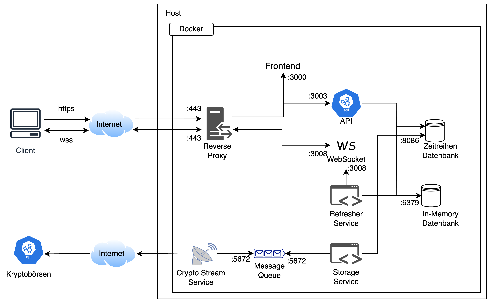

<div align="center">
 <pre>
 ██████╗██████╗ ██╗   ██╗██████╗ ████████╗ ██████╗ ████████╗██████╗  █████╗  ██████╗██╗  ██╗███████╗██████╗ 
██╔════╝██╔══██╗╚██╗ ██╔╝██╔══██╗╚══██╔══╝██╔═══██╗╚══██╔══╝██╔══██╗██╔══██╗██╔════╝██║ ██╔╝██╔════╝██╔══██╗
██║     ██████╔╝ ╚████╔╝ ██████╔╝   ██║   ██║   ██║   ██║   ██████╔╝███████║██║     █████╔╝ █████╗  ██████╔╝
██║     ██╔══██╗  ╚██╔╝  ██╔═══╝    ██║   ██║   ██║   ██║   ██╔══██╗██╔══██║██║     ██╔═██╗ ██╔══╝  ██╔══██╗
╚██████╗██║  ██║   ██║   ██║        ██║   ╚██████╔╝   ██║   ██║  ██║██║  ██║╚██████╗██║  ██╗███████╗██║  ██║
 ╚═════╝╚═╝  ╚═╝   ╚═╝   ╚═╝        ╚═╝    ╚═════╝    ╚═╝   ╚═╝  ╚═╝╚═╝  ╚═╝ ╚═════╝╚═╝  ╚═╝╚══════╝╚═╝  ╚═╝
------------------------------------------------------------------------------------------------------------
  </pre>
</div>

## What is This? 🤔

This is a CryptoTracker designed to monitor cryptocurrency prices from various exchanges in real-time. By integrating multiple technologies, the tracker fetches the prices via an API, stores this data in a specialized time-series database, and subsequently performs calculations. The primary goal of these calculations is to identify the best arbitrage opportunities between exchanges. This provides users with the capability to systematically pinpoint trading potentials in the world of cryptocurrencies.

## Quick Start 🚀

This Docker Compose configuration quickly sets up the entire CryptoTracker infrastructure for you. The setup integrates various services including data storage services like InfluxDB, Redis, and RabbitMQ, multiple application services such as the API service, refresher service, and storage service, as well as real-time data streaming from exchanges like Bitstamp and Kraken.

To get everything up and running:

1. Make sure you've set up the environment variables or **.env** file with all the necessary configurations (e.g., **INFLUXDB_PORT**, **REDIS_PASSWORD**, etc.).
2. Navigate to the root directory containing the **docker-compose.yml** file.
3. Execute the following command:

```sh
docker compose up -d --build
```

Once you've executed the command, Docker will handle the process of pulling the required images, building your services, and starting up all the containers. You'll then have a fully functional CryptoTracker system running locally. The frontend can be accessed by visiting http://localhost:3000, and other services are accessible through their specified ports, such as the API at port 3003.

## Development 🛠️

The development environment for the CryptoTracker is designed to be modular, allowing you to edit and test each service individually. For ease of development, below are instructions on how to run each service separately:

### Infrastructure

The fundamental infrastructure is comprised of databases and message brokers. To run just these essential services:

1. Navigate to:
<ul>
   <li> **/infrastructure/docker/db** </li>
   <li>**/infrastructure/message_broker/** </li>
</ul>
2. Execute the command:

```bash
   docker compose up -d
```

### Stream-Service

The Stream Service fetches cryptocurrency data from various APIs and writes them to the Message Queue. To start the Stream Service:

```bash
cd services
virtualenv -p python3 venv
source venv/bin/activate
pip install -r requirements.txt
python -m streamservice.main <exchange>
```

### Storage-Service

The Storage Service extracts data from the Message Queue and stores them in a time-series database. To start the Storage Service:

```bash
go mod download
go run cmd/storageservice/main.go
```

### API

The API serves as the interface for retrieving data from the database. You can start the API with the following command:

```bash
air
```

### Websocket

The Websocket Service ensures continuous data updates to provide real-time data:

```bash
go run cmd/websocket/main.go
```

### Refresher-Service

The Refresher Service is responsible for sophisticated computations and stores the results in the Redis database. Price changes are directly communicated to the Websocket Service.

```bash
go run cmd/datarefresher/main.go
```

### Frontend

The frontend is developed using Next.js and can be started as follows:

```bash
yarn install
yarn dev
```

## Architecture 🏗️

The architecture model, as depicted below, illustrates how various services and components seamlessly interact within the CryptoTracker system to provide a robust and real-time solution for tracking cryptocurrency prices across multiple exchanges.


